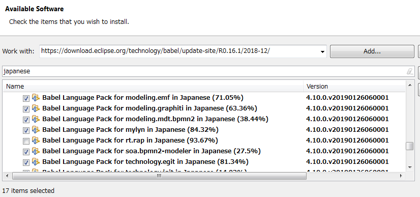
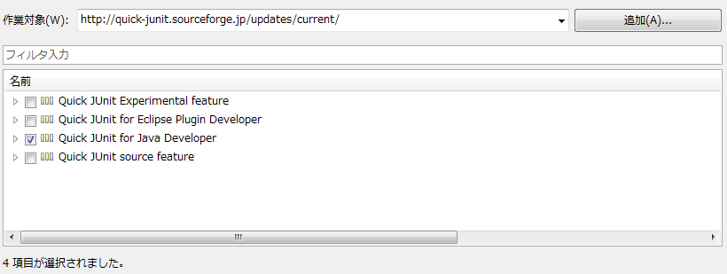

## Eclipse本体

下記から for Java Developers をダウンロードして解凍。

* [Eclipse IDE for Java Developers \| Eclipse Packages](https://www.eclipse.org/downloads/packages/release/2019-06/r/eclipse-ide-java-developers)

## 日本語化

Babelで日本語化する。

* [Eclipse Babel Project Downloads \| The Eclipse Foundation](https://www.eclipse.org/babel/downloads.php)

Help -> Install New software で、Repositoryとして下記を追加。
* https://download.eclipse.org/technology/babel/update-site/R0.16.1/2018-12/

`Babel Language Pack for rt.rap in Japanese`を入れると、ところどころでエラー(設定 -> キーが開けなくなったり、、)が起きるようになるので、rt.rapは外してインストール。

## Quick JUnit

マーケットプレイスで出てこなくなっている(対応バージョンが古いため？)ので、Help -> Install New software で、Repositoryとして下記を追加してインストール。

* http://quick-junit.sourceforge.jp/updates/current/

選択するのは`Quick JUnit for Java Developer`のみで大丈夫。

## Lombok

下記からjarをダウンロード(最新バージョン1.18.8)して起動し、Eclipseのインストール先フォルダを選択してインストール。

* [Download](https://projectlombok.org/download)

## STS

マーケットプレイスで`Spring`で検索し、`Spring Tools 4 - for Spring Boot`をインストール。

## Groovy Development Tools

マーケットプレイスで`Groovy`で検索し、`Groovy Development Tools`をインストール。
