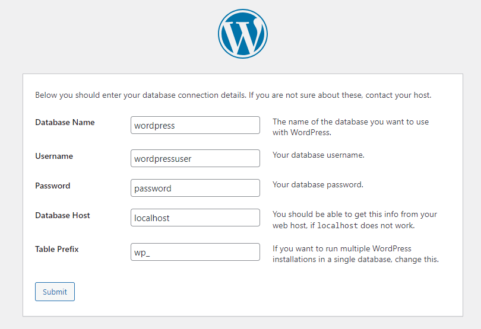

公式サイトでのWordPressインストールのドキュメント

* https://developer.wordpress.org/advanced-administration/before-install/howto-install/

## 環境

* Ubuntu 22.04

## ミドルウエアのインストール

### Apache

```
apt -y install apache2
```

### PHP

```
apt -y install php8.1
```

MySQL用の拡張も必要だったので入れる。

```
apt -y install php8.1-mysql
```

### MySQL

```
apt -y install mysql-server
```

## DBの作成

* DB: `wordpress`
* ユーザ: `wordpressuser`
* パスワード: `password`

``` sql
CREATE DATABASE wordpress;
CREATE USER wordpressuser@localhost IDENTIFIED BY 'password';
GRANT ALL PRIVILEGES ON wordpress.* TO wordpressuser@localhost;
```

## WordPressのインストール

最新は6.2.2だった。

```
wget https://wordpress.org/latest.zip
```

unzipが無かったので入れる。

```
apt -y install unzip
```

```
unzip latest.zip
```

`/wordpress` でホストする。

```
mv wordpress/ /var/www/html/
chown -R www-data:www-data /var/www/html/wordpress
```

サイトにアクセスすると、configのセットアップができるので、そこでセットアップを行う。

* http://192.168.33.10/wordpress



## mod_rewrite の設定

mod_rewriteが使われるので有効化

```
a2enmod rewrite
```

上位で .htaccess を使った上書き共用しないとダメなので

* /etc/apache2/apache2.conf

```diff
<Directory /var/www/>
        Options Indexes FollowSymLinks
+        AllowOverride All
-        AllowOverride None
        Require all granted
</Directory>
```

Apache再起動

```
systemctl restart apache2
```
